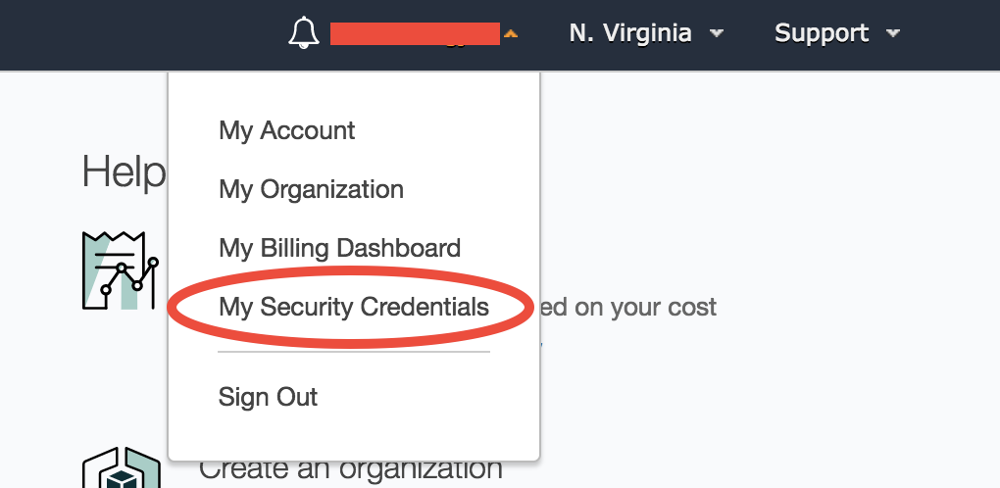
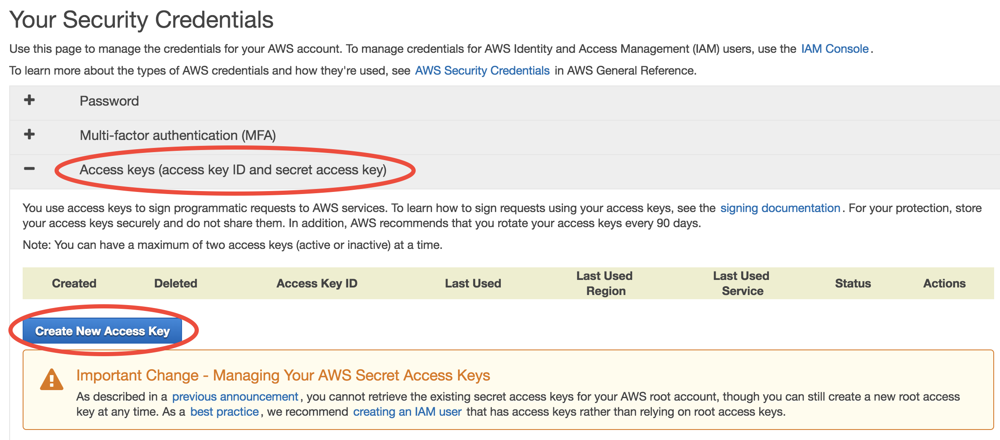
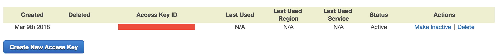

Set up AWS Command Line Interface (AWS-CLI)
===========================================

Before using the :ref:`S3 storage <s3-intro-label>`, you need to set up `AWSCLI <https://aws.amazon.com/cli/>`_ first. AWSCLI is a command line tool that can replicate everything you can do with the graphical console. It can control hundreds of AWS services, but the major use case is S3. The initial setup takes some time, but this is a one-off effort, so be patient!

Install AWSCLI
--------------

If you are on the EC2 instance launched from my tutorial AMI, AWSCLI is already installed::
  
  ubuntu@ip-172-31-46-2:~$ which aws
  /home/ubuntu/miniconda/bin/aws

You can also use AWSCLI on your own computer (which is a very common practice)::
  
  pip install awscli

.. note::
  AWSCLI is a like "Python package" that you can install into your Anaconda environment. However, it is directly used in the shell (or bash shell scripts), not an "importable package" in Python code. The actual Python tool to control AWS resources is `boto3 <https://aws.amazon.com/sdk-for-python/>`_. For most cases, AWSCLI is enough. For very complicated administrative tasks (say, launching hundreds of EC2 instances on a dedicated schedule) that are too complicated for shell scripts, consider writing Python scripts with boto3. We will not cover boto3 in this tutorial as it is generally an overkill.

Then try ``aws help`` to get general help information, or ``aws s3 help`` to get help specifically on S3.

Try to configure AWSCLI
-----------------------

If you try any actual commands like ``aws s3 ls`` (listing your S3 resources), it will fail::
  
  ubuntu@ip-172-31-46-2:~$ aws s3 ls
  Unable to locate credentials. You can configure credentials by running "aws configure". 
  
That's because you haven't configured your AWS account. Think about this: if you are using AWSCLI on your local computer, you can control your AWS resources **without** logging into the graphical console. Then, how can AWS know that it is you accessing your account? Thus you need to save your account information somewhere on your computer.

Running ``aws configure``, you will be asked 4 questions::

  ubuntu@ip-172-31-46-2:~$ aws configure
  AWS Access Key ID [None]:
  AWS Secret Access Key [None]:
  Default region name [None]:
  Default output format [None]:

"Access Key ID" and "Secret Access Key" are just like your AWS account name and password. For security reasons they are not the one you use to log into the console. You can obtain them in the "My Security Credentials" console. 

.. _credentials-label:

Obtaining security credentials
------------------------------

Click on your account name on the upper right corner of AWS console to get this memu:

Depending on the type of your AWS account, you will see slightly different interfaces, as detailed in the two subsections below.

- If you sign up for the AWS account with your own credit card, your account is a "root account" with the highest privilege (such as controlling the billing information). 
- If you obtain the AWS account from a workshop or your research group manager (without using your credit card), it is probably a `"IAM user account" <https://docs.aws.amazon.com/IAM/latest/UserGuide/id_users.html>`_ that is derived from a root account. It has less privileges (e.g. cannot see the billing information).

With root account
^^^^^^^^^^^^^^^^^

You will likely be prompted with this warning:

.. figure:: img/security_prompt.png

AWS encourages you to create "IAM users" instead of simply getting your Security Credentials. However, I find the concept of "IAM users" a bit overwhelming for who just starts to use the cloud, so I defer "IAM users" to advanced tutorials. For now, simply choose "Continue to Security Credentials" to get the science done as quickly as possible. (If you want to follow the IAM user approach right now, see the `official tutorial <https://aws.amazon.com/getting-started/tutorials/backup-to-s3-cli/>`_.)

In the Security Credential console, choose Access keys -- Create New Access Key:

In the prompted window, click on "Download Key File". That's the only chance you can download the key file. If you forget to download it before closing the window, simply delete your key and create a new one.

.. figure:: img/download_access_key.png

Keep your Key File in a safe place. Now we can answer ``aws configure`` questions.

Then your new key will appear in the console. Here you can only see the "Access Key ID" (like your AWS account), but not the "Secret Access Key" (like password, has much more digits than ID, and is only visible in the downloaded Key File).

With IAM user account
^^^^^^^^^^^^^^^^^^^^^

In the Security Credential console, click on "Create Access Key":

.. figure:: img/iam_credential_create
  :width: 500 px

Then, download the csv file that contains your "Access Key ID" (like your AWS account) and "Secret Access Key" (like password, has much more digits than ID).

.. figure:: img/iam_credential_download
  :width: 500 px

If you lose the Secret Access Key (for example, forget to download the csv file), simply delete your key in the console and create a new one.

Keep your Key File in a safe place. Now we can answer ``aws configure`` questions.

.. _awscli_configure-label:

Finish AWSCLI configuration
---------------------------

Copy and paste your Key ID and Secret Key from the Key File::

  ubuntu@ip-172-31-46-2:~$ aws configure
  AWS Access Key ID [None]: xxxxxxxxxxxxxxxxxxxx
  AWS Secret Access Key [None]: xxxxxxxxxxxxxxxxxxxxxxxxxxxxxxxxxxxxxxxx
  Default region name [None]: us-east-1
  Default output format [None]: json

- For the default region, enter ``us-east-1`` . It is just an alias to the "US East (N. Virginia)" region that you chose in the quick start guide. Currently all GEOS-Chem resources are within this region, so use it as default.
- For output format, enter ``json``. (`JSON <https://en.wikipedia.org/wiki/JSON>`_ is the most widely used format in web services. You don't need to worry about it right now. It looks almost the same as Python dictionaries and lists.)

The answers you typed are saved in ``~/.aws/credentials`` and ``~/.aws/config``. You can rerun ``aws configure`` to overwrite them, or just edit the files directly.

Now ``aws s3 ls`` should run smoothly. Since you don't have your own data on S3 yet, that command is likely to show nothing. However, you can already access tons of `AWS Public Datasets <https://aws.amazon.com/public-datasets>`_. For example, let's view the `NASA-NEX data <https://aws.amazon.com/public-datasets/nasa-nex/>`_ by ``aws s3 ls s3://nasanex/``::

  ubuntu@ip-172-31-46-2:~$ aws s3 ls s3://nasanex/
                             PRE AVHRR/
                             PRE CMIP5/
                             PRE LOCA/
                             PRE Landsat/
                             PRE MAIAC/
                             PRE MODIS/
                             PRE NAIP/
                             PRE NEX-DCP30/
                             PRE NEX-GDDP/

You will learn how to retrieve and analyze those data in the next tutorial. 

Another major use case of AWSCLI is to launch EC2 servers. You must already get tired of clicking through the EC2 console to launch a new server. You can actually launch a server with one single AWSCLI command, which is far more convenient than clicking tons of buttons. We defer this to advanced tutorials, as there are more important things to learn (S3, spot..) right now.

Additional notes
----------------

**1. About various "keys"**
  
.. note::
  
  Secret Access Key? EC2 Key Pair? Why are there are so many keys? Do not be confused: the **AWS Secret Access Key** is tied to your AWS account itself, while the **EC2 Key Pair** is only for accessing a specific server. In general, the Access Keys are stored in ``~/.aws/`` as they are general AWS configurations; while EC2 Key Pairs are stored in ``~/.ssh/``, as they are only for ``ssh``.
  
  It is totally fine to give your EC2 Key Pair to your friend to allow them to log into a your EC2 instances. You can easily create a new EC2 Key Pair to launch another EC2 instance that your friend have no access to. On the other hand, **NEVER** give you Secret Access Key to others. This will allow them to purchase AWS resources on your behalf!

.. _mention-ec2-iam-label:

**2. Simplifying AWSCLI configuration on EC2**
  
.. note::
  
  If you are using AWSCLI on EC2 instances, not on your local computer, you might wonder why you still need to configure those credentials? After all, it's on AWS's server, and AWS should know that you are using AWSCLI on your own EC2 instances. Yes, you can avoid running ``aws configure`` every time you launch a new EC2 instance. It is just not enabled by default because of security reasons. For example, you might want to allow your friend to log into your EC2 servers, but you don't want to let them control your other AWS resources using AWSCLI. 
  
  Enabling AWSCLI by default requires some understandings of IAM (Identity and Access Management), so we defer it to :doc:`advanced tutorials <../chapter03_advanced-tutorial/iam-role>`. For now, simply copy and paste your credentials -- it is pretty quick!

  