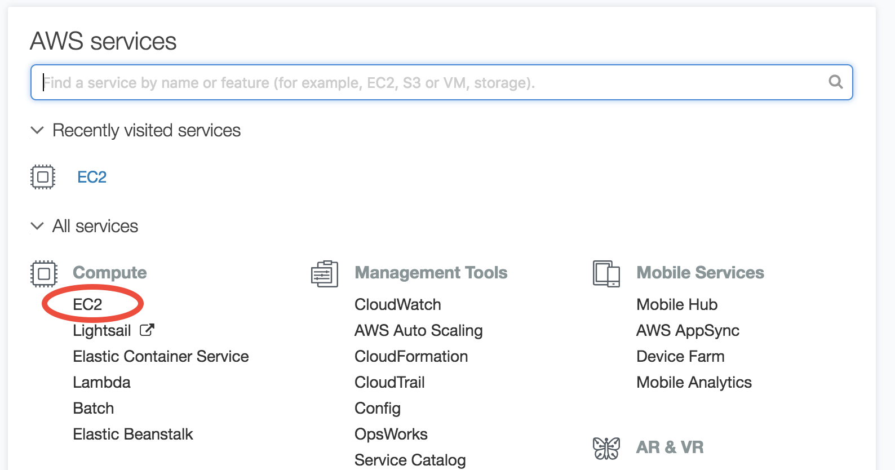
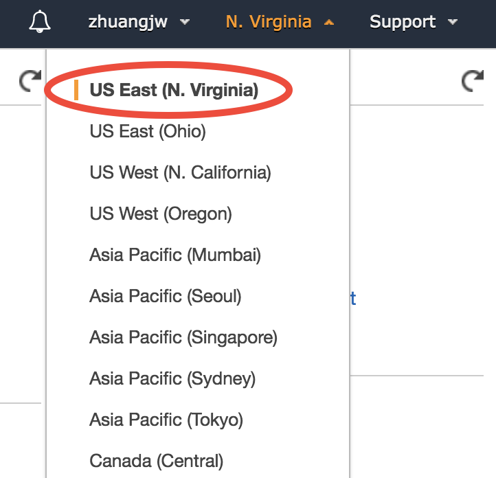
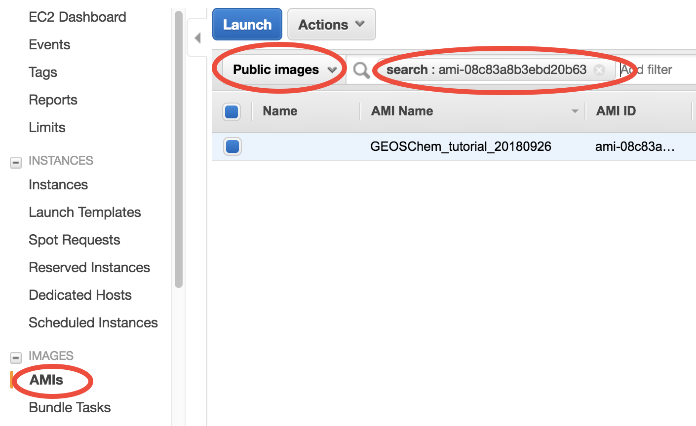
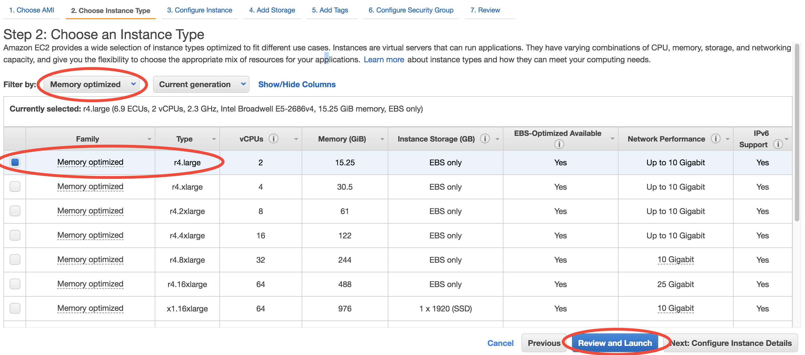
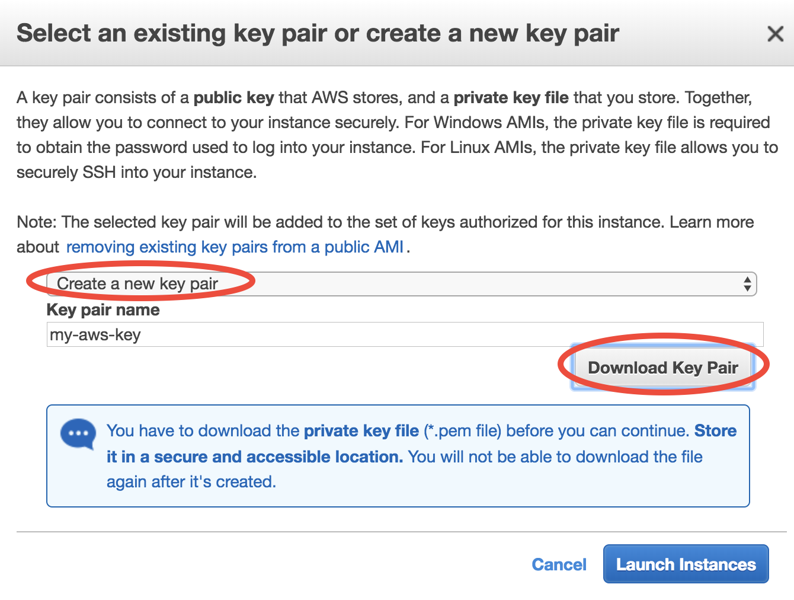
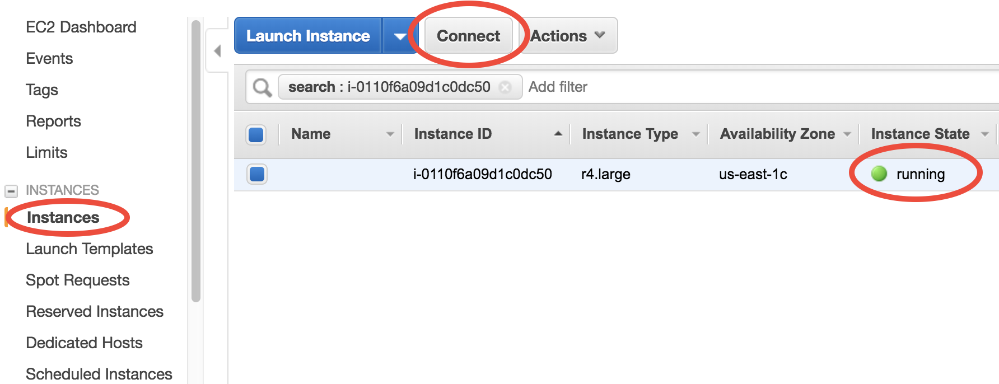
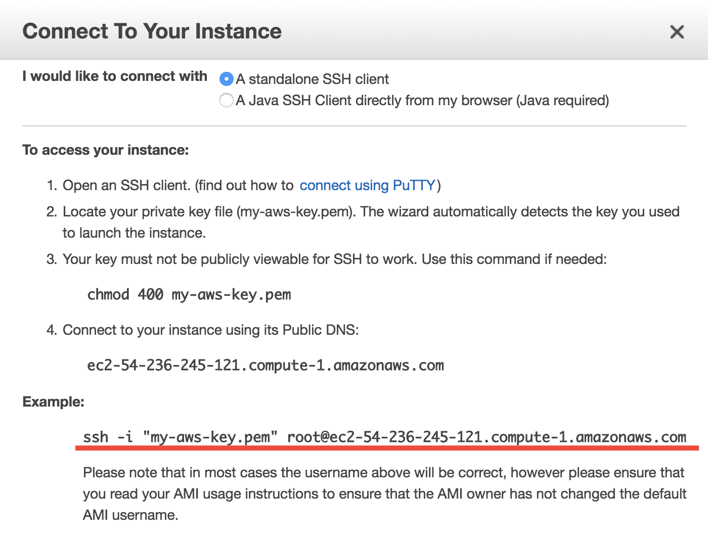
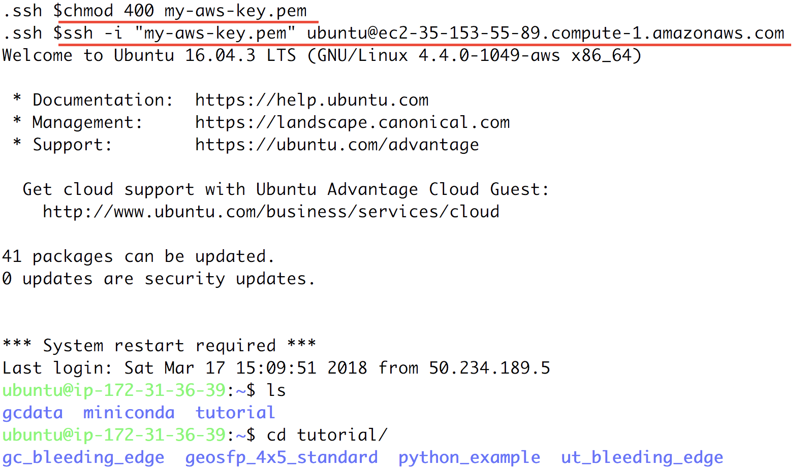
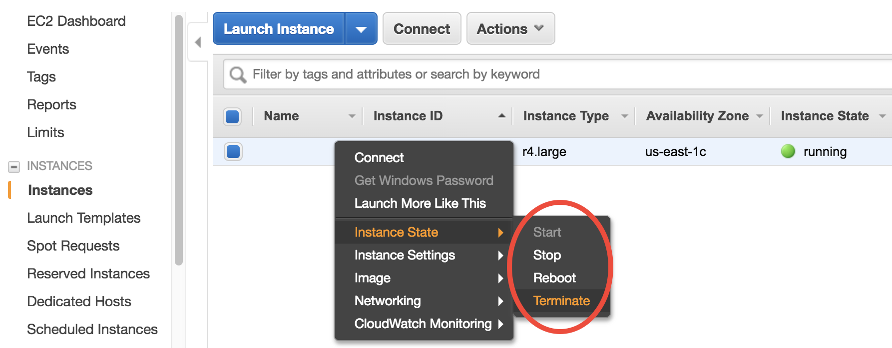

.. _quick-start-label:

Quick start guide for new users
===============================

Step 1: Sign up an Amazon Web Service(AWS) account
--------------------------------------------------

Go to http://aws.amazon.com, click on "Create an AWS account" on the upper-right corner:

(the button will become "Sign In to the Console" for the next time)

After entering some basic information, you will be required to enter your credit card number. Don't worry, this beginner tutorial will only cost you $0.1.

.. note::
  If you are a student, check out the $100 educational credit (can be renewed every year!) at https://aws.amazon.com/education/awseducate/. I haven't used up my credit for after playing with AWS for a whole year, so haven't actually paid any money to them 😉

Now you should have an AWS account! It's time to run the model in cloud. (You can skip Step 1 for the next time, of course)

Step 2: Launch a server with GEOS-Chem pre-installed 
----------------------------------------------------

Log in to AWS console, and click on EC2 (Elastic Compute Cloud), which is the most basic cloud computing service.

In the EC2 console, make sure you are in the **US East (N. Virginia)** region as shown in the upper-right corner of your console. Choosing a region closer to your physical location will give you better network. To keep this tutorial minimal, I built the system in only one region. But working across regions is not hard.

In the EC2 console, click on "AMI" (Amazon Machine Image) under "IMAGES" on the left navigation bar. Then select "Public images" and search for **ami-c135ccbc** or **GEOSChem_tutorial_20180307** – that's the system with GEOS-Chem installed. Select it and click on "Launch".

**This is one of the game-changing features of cloud computing.** An AMI means a saved system. I started with a brand new Linux system and built GEOS-Chem on it. After that, everyone is able to get a perfect clone of my system, with everything installed correctly. This magic can hardly happen on traditional machines! You can make any modifications you like to your copy, such as changing the model code, downloading more data or installing additional software. If you screw things up (e.g. install some bad software, delete important files…), you can simply launch again and start over.

You have already specified your operating system, or the "software" side of the virtual server. Then it's time to specify the "hardware" side, mostly about CPUs.

In this toy example, choose "Memory optimized"-"r4.large" to test GEOS-Chem with the minimum fee.

There are many CPU options, including numbers and types. AWS free tier also gives you 750 free hours of "t2.micro", which is the tiniest CPU. Its memory is too small to run GEOS-Chem, but it is good for testing software installation if you need to.

**Then, just click on "Review and Launch".** You don't need to touch other options this time. This brings you to "Step 7: Review Instance Launch". Simply click on the Launch button again.

For the first time of using EC2, you need to create and download a "KeyPair". This is equivalent to the password you enter to ssh to your local server, but much safer than a normal password. Here, such "password" is a file, being stored in your own computer. The only way to share your server password with others is to share that file.

Give your KeyPair a name, click on "Download Key Pair", and finally click on "Launch Instances". (for the next time, you can simply select "Choose an existing Key Pair" and launch).

You can monitor your server in the EC2-Instance console. Within < 1min of initialization, "Instance State" should become "running":

You now have your own server running on the cloud!

Step 3: Log into the server and run GEOS-Chem
---------------------------------------------

Select your instance, click on the "Connect" button near the blue "Launch Instance" button, then you should see this page:

- On Mac or Linux, copy the ``ssh -i "xx.pem" root@xxx.com`` command under "Example". 
  Before using that command to ssh to your server, do some minor stuff: 
  
  (1) ``cd`` to the directory where store your Key Pair (preferably ``$HOME/.ssh``) 
  (2) Use ``chmod 400 xx.pem`` to change the key pair's permission (also mentioned in the above figure; only need to do this at the first time).
  (3) Change the user name in that command from ``root`` to ``ubuntu``. (You'll be asked to use ``ubuntu`` if you keep ``root``).
- On Windows, please refer to the guide for `MobaXterm <http://angus.readthedocs.io/en/2016/amazon/log-in-with-mobaxterm-win.html>`_ and `Putty <https://docs.aws.amazon.com/AWSEC2/latest/UserGuide/putty.html>`_ (Your life would probably be easier with MobaXterm).

Your terminal should look like this:

That's a system with GEOS-Chem already built!

Go to the pre-generated run directory::
  
  $ cd geosfp_4x5_standard

Just run the pre-compiled the model by::
  
  $ ./geos.mp

Or you can re-compile the model on your own::

  $ make clean
  $ make -j4 mpbuild NC_DIAG=y BPCH_DIAG=n TIMERS=1

Congratulations! You’ve just done a GEOS-Chem simulation on the cloud, without spending any time on setting up your own server, configuring software environment, and preparing model input data!

The default setting only runs the model for 20 minutes, for demonstration purpose. The "r4.large" instance type we chose has only a single, slow core (so it is cheap, just ~$0.1/hour), while its memory is large enough for GEOS-Chem to start. For serious simulations, it is recommended to use "Compute Optimized" instance types with multiple cores such as "c5.4xlarge".

.. note::
  The first simulation on a new server will have slow I/O and library loading because the disk needs "warm-up". Subsequent simulations will be much faster.

Step 4: (Optional) Analyze output data with Python
--------------------------------------------------

If you wait the simulation to finish (takes 5~10 min), it will produce `NetCDF diagnostics <http://wiki.seas.harvard.edu/geos-chem/index.php/List_of_diagnostics_archived_to_netCDF_format>`_ called ``GEOSChem.inst.20130701.nc4``. There is also a pre-generated ``GEOSChem.inst.20130701_backup.nc4`` ready for you to analyze::

  ubuntu@ip-172-31-36-170:~/geosfp_4x5_standard$ ncdump -h GEOSChem.inst.20130701_backup.nc4
  netcdf GEOSChem.inst.20130701_backup {
  dimensions:
  	time = UNLIMITED ; // (1 currently)
  	lev = 72 ;
  	ilev = 73 ;
  	lat = 46 ;
  	lon = 72 ;
  variables:
  	double time(time) ;
  		time:long_name = "Time" ;
  		time:units = "minutes since 2013-07-01 00:00:00 UTC" ;
  		time:calendar = "gregorian" ;
  		time:axis = "T" ;

`Anaconda Python <https://www.anaconda.com/>`_ and `xarray <http://xarray.pydata.org>`_ are already installed on the server for analyzing all kinds of NetCDF files. If you are not familiar with Python and xarray, checkout my tutorial on 
`xarray for GEOS-Chem <http://gcpy-demo.readthedocs.io>`_. You can simply use `ipython` from the command line::
  
  ubuntu@ip-172-31-36-170:~/geosfp_4x5_standard$ ipython
  Python 3.6.4 |Anaconda, Inc.| (default, Jan 16 2018, 18:10:19)
  Type 'copyright', 'credits' or 'license' for more information
  IPython 6.2.1 -- An enhanced Interactive Python. Type '?' for help.

  In [1]: import xarray as xr

  In [2]: ds = xr.open_dataset("GEOSChem.inst.20130701_backup.nc4")

  In [3]: ds
  Out[3]:
  <xarray.Dataset>
  Dimensions:         (ilev: 73, lat: 46, lev: 72, lon: 72, time: 1)
  ...
      SpeciesConc_CO  (time, lev, lat, lon) float32 ...
      SpeciesConc_O3  (time, lev, lat, lon) float32 ...
      SpeciesConc_NO  (time, lev, lat, lon) float32 ...

A much better data-analysis environment is `Jupyter notebooks <http://jupyter.org>`_. If you have been using Jupyter on your local machine, the user experience on the cloud would be exactly the same.

To use Jupyter on remote servers, re-login to the server with port-forwarding option ``-L 8999:localhost:8999``::
  
  $ ssh -i "xx.pem" ubuntu@xxx.com -L 8999:localhost:8999
  
Then simply run ``jupyter notebook --NotebookApp.token='' --no-browser --port=8999``::

  ubuntu@ip-172-31-36-170:~$ jupyter notebook --NotebookApp.token='' --no-browser --port=8999
  [I 21:11:41.503 NotebookApp] Writing notebook server cookie secret to /run/user/1000/jupyter/notebook_cookie_secret
  [W 21:11:41.986 NotebookApp] All authentication is disabled.  Anyone who can connect to this server will be able to run code.
  [I 21:11:42.046 NotebookApp] Serving notebooks from local directory: /home/ubuntu
  [I 21:11:42.046 NotebookApp] 0 active kernels
  [I 21:11:42.046 NotebookApp] The Jupyter Notebook is running at:
  [I 21:11:42.046 NotebookApp] http://localhost:8999/
  [I 21:11:42.046 NotebookApp] Use Control-C to stop this server and shut down all kernels (twice to skip confirmation).

Visit ``http://localhost:8999/`` in your browser, you should see a Jupyter environment just like on local machines. The server contains an :doc:`example notebook <../chapter06_appendix/sample-python-code>` ``python_example/plot_GC_data.ipynb`` that you can just execute.

.. note::
  There are many ways to use Jupyter on remote servers. Port-forwarding is the easiest way, and is the only way that also works on local HPC clusters (which has much stricter firewalls than cloud platforms). The port number 8999 is just my random choice, to distinguish from the default port number 8888 for local Jupyter.

Step 5: (Very important!) Shut down the server
----------------------------------------------

Right-click on the instance in your console to get this menu:

There are two different ways to stop being charged:

- "stop" will make the system inactive, so that you'll not be charged by the CPU time, 
  and only be charged by the negligible disk storage fee.
- "terminate" will completely remove that virtual server so you won't be charged at all after that.
  Unless you save your system as an AMI or transfer the data to other storage services, 
  you will lose all your data and software.

You will learn how to save your data and configurations persistently in the next tutorials.