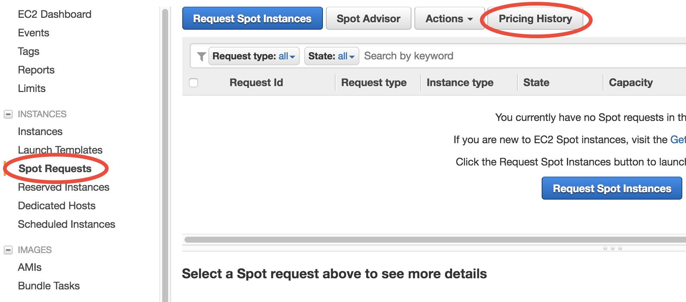
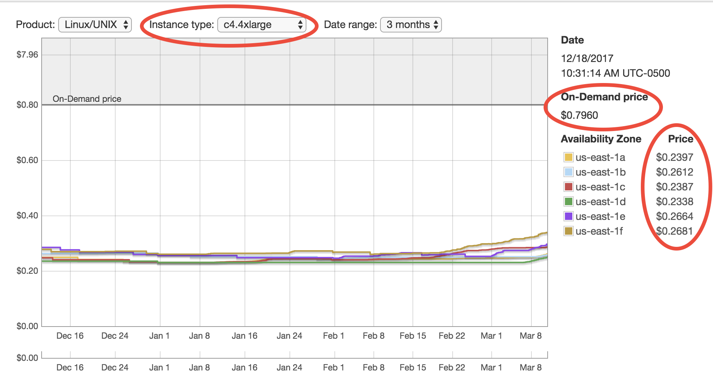
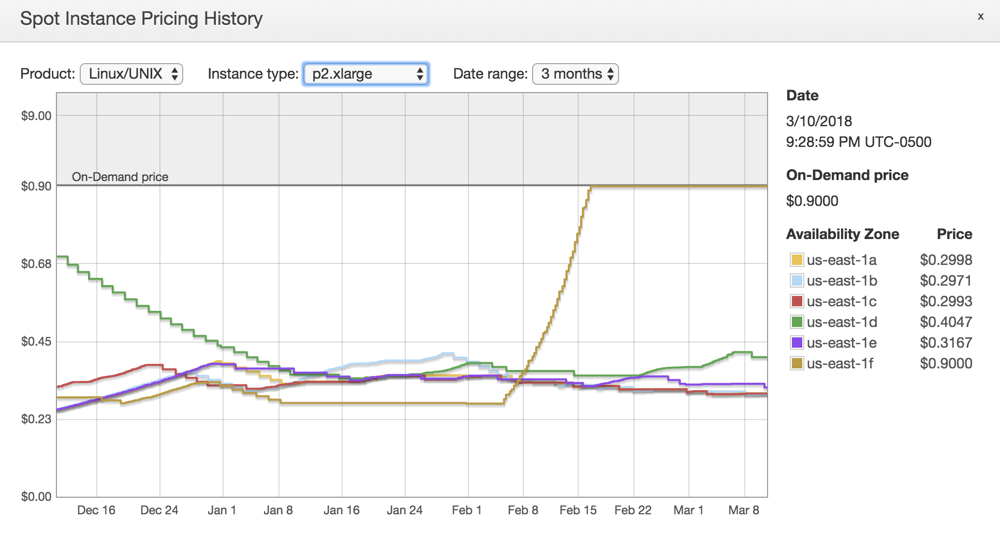

.. _spot-label:

Use Spot Instances to reduce EC2 cost
=====================================

In the :ref:`quick start guide <quick-start-label>`, you've chosen the "r4.large" instance type to conduct proof-of-concept simulations. For real, serious simulations, definitely use bigger instances with more CPU cores in the `Compute Optimized <https://aws.amazon.com/ec2/instance-types/>`_ families (e.g. c5.4xlarge, c4.4xlarge). Larger instances also have higher network bandwidth, allowing faster data transfer between EC2 and S3.

However, bigger instances are also `more expensive <https://aws.amazon.com/ec2/pricing/on-demand/>`_. While "r4.large" only costs $0.1/hour, the most powerful instance "c5.18xlarge" with 72 cores costs $3/hour. If the simulation runs for days or weeks, the total cost will be not a trivial number. The good news is, the `Spot Instance <https://aws.amazon.com/ec2/spot/>`_ pricing model can generally reduce the cost by ~70%.

What are spot instances and why they exist
------------------------------------------

The `default EC2 pricing <https://aws.amazon.com/ec2/pricing/on-demand/>`_ is called "on-demand" pricing. This service model is extremely flexible (whenever you request a server, you get it almost instantly; you can stop and restart it at any time) and very stable (the server is guaranteed to run for no matter how long, as long as you don't stop it on purpose). This kind of high quality is needed by `web servers <https://en.wikipedia.org/wiki/Web_server>`_ which have to be stable for a long time, but it is often an overkill for scientific computing workflows which are generally intermittent. By allowing the server to be a little bit sloppy, the cost can be drastically reduced. That's the role of spot instances.

In the EC2 console, go to "Spot Requests" page, and then click on "Pricing History". 

Choose an instance type, for example "c4.4xlarge". You should see that spot prices are only 1/3~1/4 of the on-demand price. Only $0.2/hour for 16 modern CPU cores? Almost insane. 

Each "Availability Zone" has its own spot price. You will get the cheapest one by default. (Recall that different `Avail Zones <https://docs.aws.amazon.com/AWSEC2/latest/UserGuide/using-regions-availability-zones.html>`_ are physically located at different locations. This was mentioned in the :ref:`EBS tutorial <ebs-az-label>`.)

Spot prices are fluctuating according to current user demand. **Once the price exceeds the on-demand price, your spot instance will be reclaimed by AWS to serve on-demand users who pay much more.** That's why they are "sloppy" and thus much cheaper than standard, on-demand instances.

But from the above figure it seems like the spot prices are consistently much lower than the on-demand price, for the entire 3 months? Does the price ever exceeds on-demand price? Yes, it does. For example this GPU instance (perhaps too many people are :ref:`training neural nets <deep-learning-label>`):

However, in general, the chance of spot instance shut-down is pretty low, especially during a model simulation (at most takes several days, sometimes just hours). The cost saving is quite big so I recommend using spot instances for serious, compute-intensive simulations.

.. note::
  Still feel uncomfortable about the possibility of losing your server? The chance is really low and there are even people wondering `why on-demand instances are still being used <https://stackoverflow.com/a/11996798/8729698>`_ since spot instances look so sweet. Think about this: "100% stability" (on-demand) can be much more expensive than "99.5% stability" (spot). There are people who are willing to pay much more for the last 0.5%. Those people are generally not scientific researchers.

Use spot instances for big computing
------------------------------------

You could click on "Request Spot Instances" in the "Spot Requests" page, but the user interface looks kind of unfamiliar for new AWS users and contains some advanced settings that I'd like to skip for now. Instead, we can launch spot instances using the old way in the :ref:`quick start guide <quick-start-label>`.

Launch a new EC2 instance just like in the quick start guide, but in "Step 2: Choose an Instance Type" select a bigger instance such as "c4.4xlarge", and go to "Step 3: Configure Instance Details":

.. figure:: img/spot_configure.png

Select "Request Spot instances", enter the on-demand price for the "Maximum price" option. You can also use a different price limit other than the on-demand price. Once the spot price goes beyong that limit, your server will be reclaimed. In other words, you will never pay a price higher than the limit you set. You can even set the price higher than on-demand but `this is generally not recommended <https://devops.stackexchange.com/questions/893/why-is-the-aws-ec2s-spot-price-greater-than-the-on-demand-price>`_.

No need to touch other options. Then just launch as usual. This spot request should be fulfilled pretty quickly, and your server will be running as usual. Just ``ssh`` to your server. You can make sure you do get 16 cores by ``lscpu``::

  $ lscpu
  Architecture:          x86_64
  CPU op-mode(s):        32-bit, 64-bit
  Byte Order:            Little Endian
  CPU(s):                16
  ...

Then set OpenMP thread number and run the model as usual::

  $ export OMP_NUM_THREADS=16
  $ ./geos.mp

(It is also OK to have ``OMP_NUM_THREADS`` unset, as the program will use the number of cores by default, which is exactly 16 here.)

The model will run ~10x faster on this advanced instance than on the previous "r4.large". Because you're using spot, you don't pay a lot more (likely just double, from $0.1/hour to $0.2/hour).

.. note::

  c4.4xlarge or c5.4xlarge? `C5 <https://aws.amazon.com/ec2/instance-types/c5/>`_ is a newer generation, and is ~10% faster than C4. Further, the on-demand price of C5 is ~10% cheaper than C4. So seems like C5 is clearly more cost-effective. But this might not be true for spot prices which depend on the current market. In general, both familities are pretty good for HPC workloads.

If you like, try performing a 1-month simulation on this fast machine. This would take several hours so you might want to :ref:`keep the program running even after logging off the server <keep-running-label>`.

Spot instances cannot be stopped and can only be terminated. Make sure you've transfering important data to S3 before terminating the server.

Deal with spot instance interruptions
-------------------------------------

Well, most of time I simply ignore the fact that they `might be interrupted <https://docs.aws.amazon.com/AWSEC2/latest/UserGuide/spot-interruptions.html>`_. After using AWS for a year, I haven't experienced a true spot shut-down, unless I set the price limit to a very low value intentionally.

If you are super cautious, put your run directory and output data :ref:`in an additional EBS volume <ebs-az-label>`. When the spot instance dies, additional volumes will not be affected, and you can attach them to another EC2 instances. No need to worry about input data unless you've made your own modifications to them, since all input data can be retrieved from :ref:`our public S3 bucket <gcdata-bucket-label>`.

It is also possible to retrieve data in the root EBS volume of the spot instance, but that is a bit cumbersome since the root volume also contains system files (which feels kind of messy if you are unfamiliar with Linux system file structure). On the other hand, additional volumes have nothing but your own data.

.. note::
  Besides "On-demand" and "Spot", there is also a `"Reserved Instance" <https://aws.amazon.com/ec2/pricing/reserved-instances/>`_ pricing model. Unless you are running models 24 hours a day, 7 days a week, this type won't help too much.
