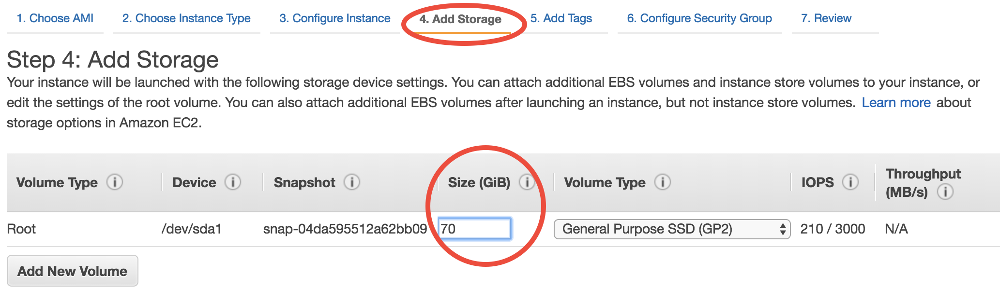
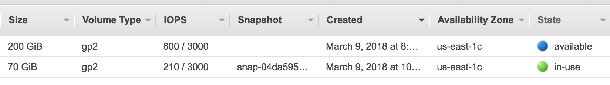
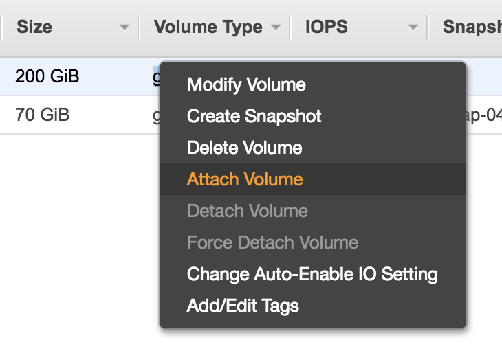
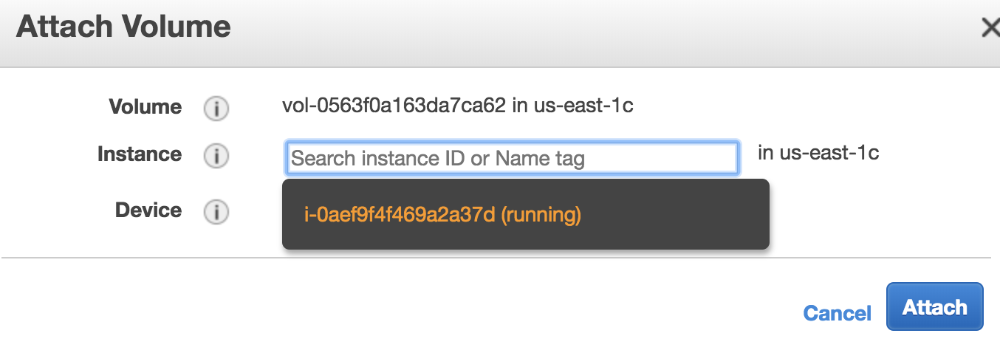

Use EBS volumes as temporary disk storage
=========================================

In the previous tutorial you've learned S3, which is independent of any EC2 instances. :ref:`EBS volumes <ebs-intro-label>`, on the other hand, are traditional disks that directly used by EC2. Whenever you are using EC2 you are also implicitly using EBS (it's just the disk!). Here we just briefly show how to view&control them in the console.

Viewing existing EBS volumes
----------------------------

The EC2 instance launched from the tutorial AMI has 70 GB of disk storage by default::

  ubuntu@ip-172-31-46-2:~$ df -h
  Filesystem      Size  Used Avail Use% Mounted on
  udev            7.5G     0  7.5G   0% /dev
  tmpfs           1.5G  8.7M  1.5G   1% /run
  /dev/xvda1       68G   58G   11G  85% /

When the instance is running, you can see the underlying EBS volume in the EC2 console:

.. figure:: img/root_ebs_in_console.png

Choose volume size at launch time
---------------------------------

The easiest way to increase your EC2 instance's disk size is during launching. In the :ref:`quick start guide <quick-start-label>` you've skipped all EC2 configuration details. Step 4 of the configuration specifies disk size:

(we will gradually cover other configuration details throughout the rest of tutorials)

The default number is the minimum storage requirement of the AMI. For a fresh operating system, the requirement is 8 GB. My tutorial AMI contains input data so I require it to be at least 70 GB. If you need a larger disk to host more output data, just enter a larger number. The maximum size of a single volume is `16 TB <https://docs.aws.amazon.com/AWSEC2/latest/UserGuide/EBSVolumeTypes.html>`_. You don't need to change Volume Type in most cases.

But you might already have an EC2 instance running and don't want to start over. Another way to add disk storage is creating additional volumes, as detailed below.

Attach new volumes after EC2 launch (Optional)
----------------------------------------------

.. note::
  This part is not absolutely necessary for a typical research workflow so free feel to jump to the :ref:`next tutorial on Spot Instances <spot-label>` which is more important for scientific computing.

Launch and attach a volume
^^^^^^^^^^^^^^^^^^^^^^^^^^

.. _ebs-az-label:

Click on the "Create Volume" button in the "Volumes" page. You should see:

.. figure:: img/create_ebs_volume.png

Key parameters are "Size" (say you need a 200 GB disk in this case) and "Availability Zone" (a new concept). Keep other options as default. Currently there are 6 Avail Zones in the us-east-1 region (i.e. N. Virginia). EBS volumes are only attachable to EC2 instances in the same Avail Zone, because different Avail Zones are physically located at different locations (how can you attach a USB drive to a computer in another building?).

You can see the Avail Zone of your running instances in the EC2 console, "Instance" page: 

.. figure:: img/avail_zone.png
  :width: 400 px

In this case my EC2 instance is running in us-east-1c, thus I need to also launch the EBS volume into us-east-1c.

Then you should see two active volumes in the EC2 console, "Volumes" page:

The "in-use" one is the disk for the runnning EC2 instance. The "available" one is the newly-created volume that isn't attached to an EC2 instance yet.

Right click on the new volume and choose "Attach Volume":

You should be prompted with ID of the running EC2 instance. If nothing gets prompted, double check if you choose the same Avail Zone for your EC2 instance and EBS volume.

After attaching, the ``lsblk`` command will show the new 200 GB volume.

::

  $ lsblk
  NAME    MAJ:MIN RM  SIZE RO TYPE MOUNTPOINT
  xvda    202:0    0   70G  0 disk
  └─xvda1 202:1    0   70G  0 part /
  xvdf    202:80   0  200G  0 disk

(An equivalent way to replicate the above steps is during launching the EC2 instance, "Step 4: add storage", click on "Add New Volume". But you still need to do the below steps to make that volume usable)

Make that volume usable
^^^^^^^^^^^^^^^^^^^^^^^

Before actually using this additional disk, you need to type a few commands. If you have no idea about file system management, simpliy copy and paste the following commands without thinking too much (adapted from `AWS official guide <https://docs.aws.amazon.com/AWSEC2/latest/UserGuide/ebs-using-volumes.html>`_).

Create a file system (only needed for newly-created volumes)::

  $ sudo mkfs -t ext4 /dev/xvdf
  mke2fs 1.42.13 (17-May-2015)
  ...
  Writing superblocks and filesystem accounting information: done

Mount it to a new directory (use any directory name you like)::

  $ mkdir new_disk
  $ sudo mount /dev/xvdf new_disk

Then you should see the ``/dev/xvdf`` file system is mounted on the ``/home/ubuntu/new_disk`` directory::
  
  $ df -h
  Filesystem      Size  Used Avail Use% Mounted on
  udev            7.5G     0  7.5G   0% /dev
  tmpfs           1.5G  8.6M  1.5G   1% /run
  /dev/xvda1       68G   58G   11G  85% /
  tmpfs           7.5G     0  7.5G   0% /dev/shm
  tmpfs           5.0M     0  5.0M   0% /run/lock
  tmpfs           7.5G     0  7.5G   0% /sys/fs/cgroup
  tmpfs           1.5G  4.0K  1.5G   1% /run/user/1000
  /dev/xvdf       197G   60M  187G   1% /home/ubuntu/new_disk

By default, the new directory belongs to the root user. Change the ownership so you don't need root permission to access it::

  $ sudo chown ubuntu new_disk

Test if you can write files into that new disk::
  
  $ touch new_disk/test_file
  [no error occurs]

Done! This disk size of your server is now much bigger. EBS volumes are useful for hosting input/output data temporarily. For long-term, persistently storage, alway upload your stuff to S3. S3 is much more "transparent" than EBS. To know what's in an EBS volume, you have to attach it to an EC2 instance and view the files through EC2. On the other hand, you can view all your files on S3 directly in the graphical conole, without having any EC2 instances running.

You can also detach the volume and re-attach it to another EC2 instance, as a way to share data between two EC2 instances. However, using S3 as the medium of data transfer is generally more convenient, and it doesn't require two EC2 instances to be in the same Avail Zone.

.. warning::
  Terminating your EC2 instance will not remove attached EBS volumes. You need to delete them manually.

Save volumes into snapshots (Optional)
--------------------------------------

:ref:`Recall <ebs-intro-label>` that EBS price is $100/TB and S3 price is $23/TB.  There is something in between, called `"snapshot EBS volumes to S3" <https://docs.aws.amazon.com/AWSEC2/latest/UserGuide/EBSSnapshots.html>`_, which causes $50/TB. You seldom need to use this functionality (since simply using S3 itself is more convenient), but the concept is quite important -- AMIs are actually backed by "EBS snapshots", which physically live on S3.

.. note:: 
  Remember the "warm-up" time I mentioned in the quick start guide? It is not any physical "warm-up" at all -- it is because the data are being pulled from S3 to the EBS volume under the hood. For a newly-created EC2 instance, although it looks like all files are already on that server, the actual data content actually live on S3. The data will be pulled from S3 on-the-fly whenever your try to access it. Thus the first simulation has quite slow I/O. After the data actually live on EBS, the subsequent I/O will be much faster.
