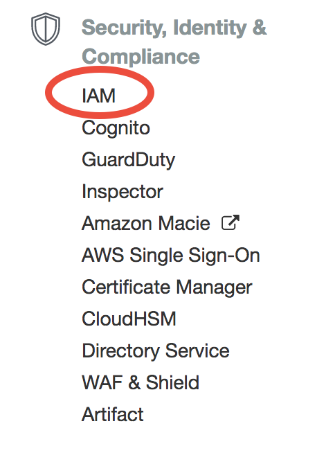
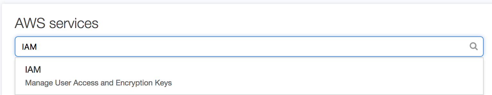
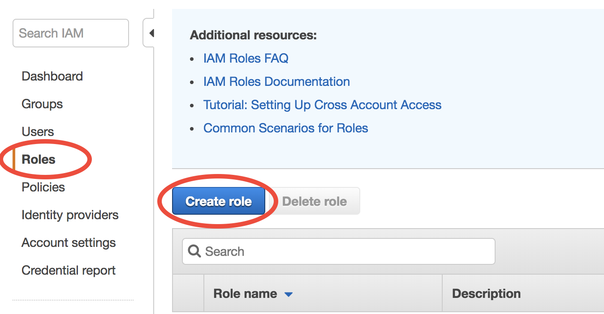
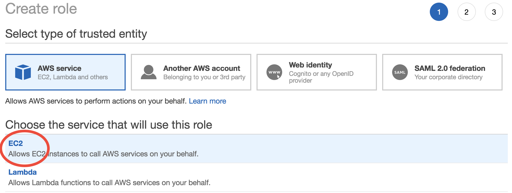
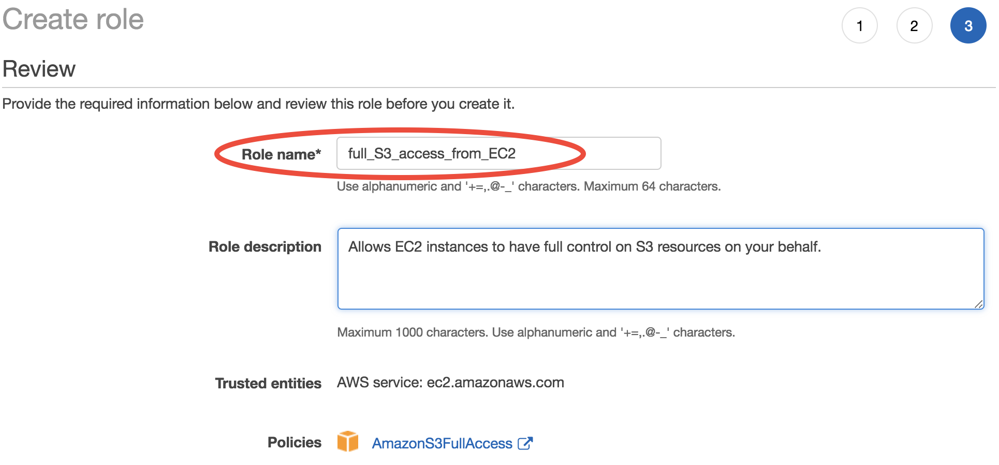
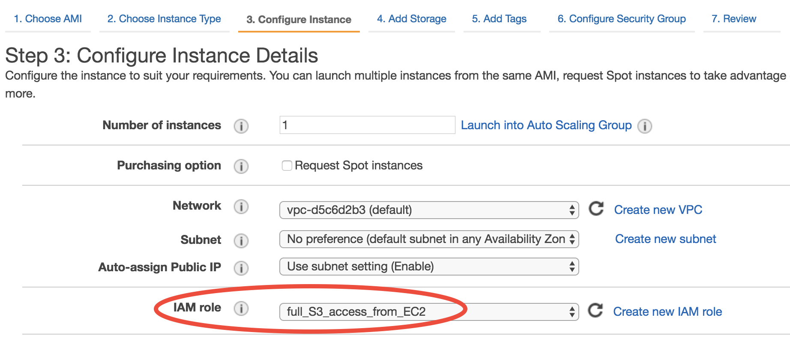

Enable S3 access from EC2 by IAM role
=====================================

I've promised you :ref:`in the beginner tutorial <mention-ec2-iam-label>` that you can skip ``aws configure`` before using AWSCLI on EC2. Here is how. The initial configuration takes a few steps, but once it's done your overall workflow will be simplified quite a bit.

What is Identity and Access Management (IAM)
--------------------------------------------

`Identity and Access Management (IAM) <https://aws.amazon.com/iam/>`_ is a very powerful ultility to **control the permissions** of your AWS resources. More specifically, a "permission" is: 

  **X is allowed to use Y**

"Y" is generally some AWS resources, like EC2 or S3. In the most common case, "X" is a specific user. You can create multiple **users** under a single AWS **account** (an "account" is tied to a single credit card); each user can have its unique ID, password, and permissions. This is useful for managing a research group, but not quite useful if you are the only user.

The :ref:`Researcher’s Handbook <researcher-handbook-label>` has very detailed instructions on how to set multiple users (called "IAM users"), so I will not repeat it here. You, the account owner, are also encouraged to create an IAM user for yourself, instead of using the root AWS account to log in (as you've been doing till now). This is again for security reasons. An IAM user will never have access to the billing information and your credit card number, even if that user has the most powerful "AdministratorAccess" which is almost equivalent to root access.

.. note::
  Yes, there are just so many "security best practices" on AWS (Key Pairs, security groups, IAM users...), and their benefits are not intuitive to researchers who really just want to get the computing done and publish papers. But please do check out those security stuff when you have time.

To further complicate things, **"X" doesn't have to be a human user, but can also be a AWS resource**. This is what we want to do here -- grant S3 access to our EC2 instances, i.e.

  | **"X" = our EC2 instances**
  | **"Y" = S3 buckets**

"Y" can also be as detailed as "read-only access to S3" (so, no write access) or even "read-only access to a specific S3 bucket" (so, no access to other buckets). All those possible combinations make the IAM console kind of daunting for beginners. Fortunately, here we only need to enable a simple permission rule, which it is very easy to do.

Grant S3 permission to EC2
--------------------------

Create a new IAM role 
^^^^^^^^^^^^^^^^^^^^^

Choose "IAM" in the AWS main console:

It can also be searched from the top search bar, so you don't have to look through hundreds of AWS services:

Then choose "Roles" in the IAM console and click on "Create role":

The first step is to choose "X" (which will be allowed to access "Y"). AWS called it "trusted entity". Select EC2, of course.

The second step is to choose "Y". Search for "S3" and then select "AmazonS3FullAccess":

.. figure:: img/create-iam-role-step2.png

Finally, give this role a descriptive name. Here I use "full_S3_access_from_EC2". (For the "Role description", enter whatever you like or just keep default.)

Now a new IAM role is created. This only needs to be done once.

Assign that role to EC2
^^^^^^^^^^^^^^^^^^^^^^^

Whenever you launch a new EC2 instance, in "Step 3: Configure Instance Details", select the IAM role you created previously for the "IAM role" option.

No need to touch other options on this page and just launch as usual. On this EC2 instance, you don't need to run ``aws configure``, and commands like ``aws s3 ls`` will just work (as long as AWSCLI is installed). This is actually a better practice since you never type your security credentials on this server (which might be stolen if your server gets hacked).

This IAM role configuration can be further :doc:`automated by AWSCLI scripts <./advanced-awscli>`.