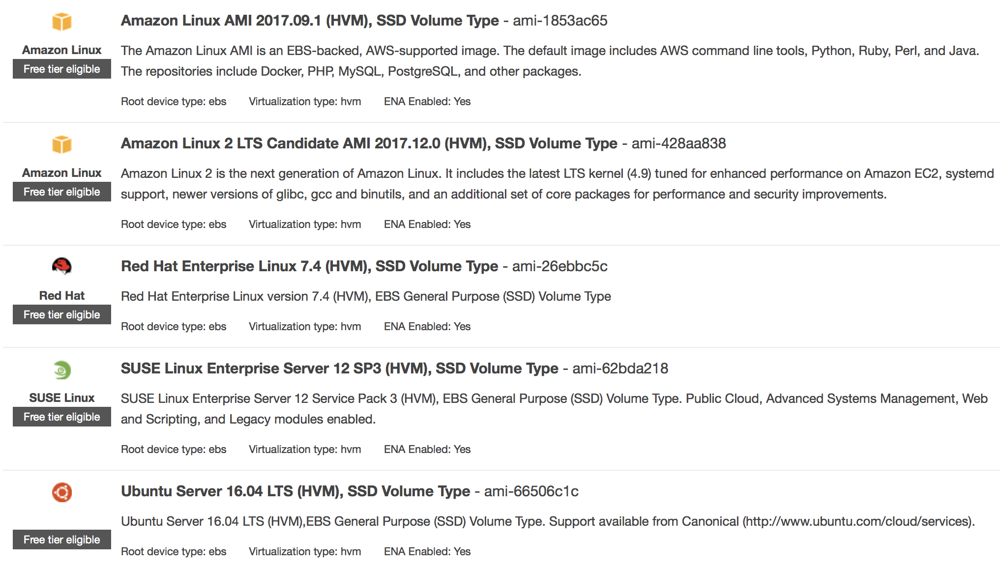

Install compilers and NetCDF libraries
======================================

Start with a brand new system
-----------------------------

Please follow `AWS official tutorial <https://aws.amazon.com/getting-started/tutorials/launch-a-virtual-machine/>`_ to launch an EC2 instance with a branch new Linux system. The only difference from our :ref:`quick start guide <quick-start-label>` is in "Step 1: Choose an Amazon Machine Image (AMI)". Instead of starting with our tutorial AMI, here you will start with a basic AMI with almost nothing installed. 

AWS promotes their `Amazon Linux AMI <https://aws.amazon.com/amazon-linux-ami/>`_ but there are many other options:

So which to choose? Recall that Linux distributions fall into two big categories:

1. **The Debian family**, such as `Debian GNU/Linux <https://en.wikipedia.org/wiki/Debian>`_ and `Ubuntu <https://en.wikipedia.org/wiki/Ubuntu_(operating_system)>`_. They use ``apt`` as the high-level package manager and ``dpkg`` as the low-level one.

2. **The Red Hat family**, such as `Red Hat Enterprise Linux (RHEL) <https://en.wikipedia.org/wiki/Red_Hat_Enterprise_Linux>`_ and `CentOS <https://en.wikipedia.org/wiki/CentOS>`_. Amazon Linux also belongs to this family. They use ``yum`` as the high-level package manager and ``rpm`` as the low-level one.

Ubuntu tends to have the largest user base; CentOS seems to be widely used on HPC clusters; Amazon Linux has the most native AWS support. I find the model performance almost the same on different systems; but this could depend on specific programs.

In this guide, we use with **Ubuntu 16.04 LTS (ami-66506c1c)** as the major example. Commands for **Amazon Linux 2017.09.1 (ami-1853ac65)** are also provided for reference.

To test software installation, the smallest instance "t2.micro" is good enough. 

Install C and Fortran compilers
-------------------------------

Ubuntu
^^^^^^

On Ubuntu, first update package metadata::

  $ sudo apt-get update

We use the GNU compiler family which is free and open source::

  $ sudo apt-get install gcc gfortran

(Alternatively, you can `install Intel compilers <https://software.intel.com/en-us/articles/installing-intel-parallel-studio-xe-on-aws-linux-instances>`_ if you have the license, or `PGI compilers <http://www.pgroup.com/index.htm>`_ for CUDA Fortran and OpenACC support.)

Executables will be installed to ``/usr/bin/``::

  $ which gcc gfortran
  /usr/bin/gcc
  /usr/bin/gfortran

By default the package manager gets 5.4.0::

  $ gcc --version
  gcc (Ubuntu 5.4.0-6ubuntu1~16.04.9) 5.4.0 20160609
  ...
  $ gfortran --version
  GNU Fortran (Ubuntu 5.4.0-6ubuntu1~16.04.9) 5.4.0 20160609
  ...

You can also install higher versions from the `Toolchain test builds <https://launchpad.net/~ubuntu-toolchain-r/+archive/ubuntu/test>`_, for example::

  $ sudo add-apt-repository ppa:ubuntu-toolchain-r/test
  Press [ENTER]
  $ sudo apt-get update
  $ sudo apt-get install gfortran-7

Amazon Linux
^^^^^^^^^^^^

For Amazon Linux, the equivalent command is::

  $ sudo yum install gcc gcc-gfortran

It gets 4.8.5 by default::

  $ gcc --version
  gcc (GCC) 4.8.5 20150623 (Red Hat 4.8.5-11)
  $ gfortran --version
  GNU Fortran (GCC) 4.8.5 20150623 (Red Hat 4.8.5-11)

Install NetCDF library with package manager
-------------------------------------------

The `NetCDF library <https://www.unidata.ucar.edu/software/netcdf/>`_ is ubiquitously used in Earth science models. Getting it from the package manager is extremely easy and quick.

Ubuntu
^^^^^^

On Ubuntu, simply::

  $ sudo apt-get install libnetcdf-dev libnetcdff-dev

Note that "dev" stands for "development tool" since you are going to use it to compile models. (it is not "developing version" -- the package repository is quite mature and stable!) Also note that after version 4.2, the NetCDF-C and NetCDF-Fortran libraries are installed separately.

Check NetCDF-C configuration::

  $ nc-config --all

  This netCDF 4.4.0 has been built with the following features:
  ...

Check NetCDF-Fortran configuration::

  $ nf-config --all

  This netCDF-Fortran 4.4.3 has been built with the following features:
  ...
  --prefix    -> /usr
  --includedir-> /usr/include
  --version   -> netCDF-Fortran 4.4.3
  
``--includedir`` will be used to include this NetCDF library when compiling Fortran code.

Amazon Linux
^^^^^^^^^^^^

For Amazon Linux, NetCDF libraries are not in the default repository. You need to first enable the `Extra Packages for Enterprise Linux (EPEL) <https://fedoraproject.org/wiki/EPEL>`_::

  $ sudo yum-config-manager --enable epel

(See `AWS guide <https://aws.amazon.com/premiumsupport/knowledge-center/ec2-enable-epel/>`_ for enabling EPEL on CentOS and Ret Hat).

Then get NetCDF from the EPEL repo::

  $ sudo yum install netcdf-devel

This currently gives you 4.1.1 with C and Fortran bundled together::

  $ nc-config --all

  This netCDF 4.1.1 has been built with the following features:
  ...

(CentOS's package registry has a newer version of NetCDF which separates Fortran and C libraries, so you would need ``sudo yum install -y netcdf-devel netcdf-fortran-devel``)

However, this NetCDF distribution seems to lack ``/usr/include/netcdf.mod`` for ``use netcdf`` statement in Fortran 90 code. The ``include 'netcdf.inc'`` statement would work fine. 

CentOS will put one at ``/usr/lib64/gfortran/modules/netcdf.mod``. The include statement needs to be changed to ``-I/usr/lib64/gfortran/modules/``.

Test sample NetCDF code
-----------------------

Get some `sample code <https://www.unidata.ucar.edu/software/netcdf/examples/programs/>`_, such as `simple_xy_wr.f90 <https://www.unidata.ucar.edu/software/netcdf/examples/programs/simple_xy_wr.f90>`_.

::

  $ wget https://www.unidata.ucar.edu/software/netcdf/examples/programs/simple_xy_wr.f90
  $ gfortran simple_xy_wr.f90 -o test_nc.exe -I/usr/include -lnetcdff
  $ ./test_nc.exe
  *** SUCCESS writing example file simple_xy.nc!

Install ``ncdump`` to check data content::

  $ sudo apt install netcdf-bin
  $ ncdump -h simple_xy.nc
  netcdf simple_xy {
  dimensions:
  	x = 6 ;
  	y = 12 ;
  variables:
  	int data(x, y) ;
  }

(Optional) Install NetCDF from source code
------------------------------------------

You might want to build NetCDF from source if:

1. To install into a different directory. Package managers can only install libraries into ``/usr``.
2. To ensure the latest version. Package managers are not necessarily up-to-date.

Doing so is quite tedious so we will not cover it here. Please refer to the `official guide <https://www.unidata.ucar.edu/software/netcdf/docs/getting_and_building_netcdf.html>`_.

For NetCDF library, you generally won't get better performance by compiling it from source with better optimized compiler settings. That's because NetCDF is just an I/O library, not for numerical computation. However, for other compute-oriented libraries, compiling from source can sometimes make a big difference in performance.