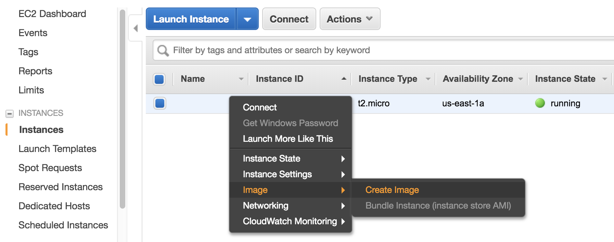

Save your system and share with others
======================================

After you've installed compilers and libraries, you would like to save those changes. Libraries are system-dependent so cannot be simply uploaded to S3. You need to save the entire system instead. (The system image will :ref:`physically live on S3 <ebs-snap-label>` anyway, but the backup process is handled by AWS to ensure system integrity)

Right-click on your EC2 instance, and select "Image" - "Create Image":

.. warning::
  
  If you are going to make an AMI for public use, make sure you did not leave any private information on the EC2 instance, such as your AWS security credientials or your GitHub credientials. Also clean your command history by ``shred -u ~/.*history``. Please refer to `AWS official doc <https://docs.aws.amazon.com/AWSEC2/latest/UserGuide/building-shared-amis.html>`_ for the full guidelines.

Give your AMI a meaningful name, edit "Image description" as you like. and then simply click on "Create Image". Then, your EC2 instance will reboot and you will lose connection for several seconds.

.. figure:: img/config-ami.png

AMI creation can take a while. For this small one it will take several minutes; bigger ones might take an hour. You will final see the new AMI in EC2 console:

.. figure:: img/ami-permission.png
  :width: 550px

It is private by default. You can change the permission to public if you wish. The change might take several minutes to take effect. Note that the AMI entry's first column, "Name", is just a convenient label (`"Name Tag" <https://docs.aws.amazon.com/AWSEC2/latest/UserGuide/Using_Tags.html>`_) to help you remember what this resource is for. It is only visible to you and can be modified at any time. Other users can only see the second column, "AMI Name", which cannot be changed after AMI creation.

An :ref:`EBS snapshot <ebs-snap-label>` is also created automatically to host the actual data for that AMI. It looks pretty indistinguishable from EBS snapshots created directly from EBS volumes (except that the "Description" column shows "Created by CreateImage..."). Edit its name tag as you like to make it look less confusing.

.. figure:: img/ebs-snap-for-ami.png

That's all you need to know about AMIs. AMIs are convenient for infrequent build. If you need to update software constantly, consider containers instead.