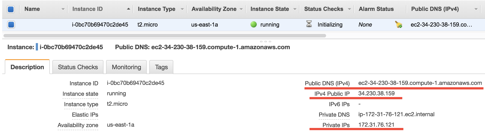

Common AWS concepts (but often confuse non-IT people)
=====================================================

While this entire documentation is about using AWS for **scientific computing**, one should always keep in mind that AWS is mainly designed for **IT/web applications**. Although I've been trying to avoid any IT concepts throughout the tutorials, all kinds of IT jargons will pop up here and there, when you are navigating through the AWS console or looking at their documentations.

Here I try to give a gentle introduction to the most basic IT stuff, to make you feel more comfortable with AWS jargons.

.. _az-detail-label:

Regions and Availability Zones
------------------------------

`Regions and Avail Zones <https://docs.aws.amazon.com/AWSEC2/latest/UserGuide/using-regions-availability-zones.html>`_ describe the geographical distribution of AWS services and data centers (i.e. actual buildings). **Region** is a top-level concept that refers to a pretty big area such as us-east-1 (N. Virginia) and us-west-2 (Oregon). All AWS resources (EC2, S3...) in one region are fairly isolated from other regions. The EC2 console only shows one single region (selectable from the upper-right corner). The S3 console displays your buckets in all regions on the same page, but each S3 bucket can live in a different region, as shown by the "Region" column. Transfering data within a region is always free (no matter EC2 to S3, S3 to EC2, or EC2 to EC2); transfering data accross regions `costs $10~20/TB <https://aws.amazon.com/ec2/pricing/on-demand/>`_. Note that cross-region data transfer is significantly slower than in-region transfer.

Inside a region, there are ~5 **Avail Zones** (called us-east-1a, us-east-1b...). An Avail Zone corresponds to a **physical** place where AWS data centers are actually located. Compared to "Region", an Avail Zone is a much smaller area, maybe like a town. Having machines distributed over multiple places ("towns") makes the entire system much more resilient. If a town suffers from power outage, only one Avail Zone will die but others will work as usual. EC2 instances and EBS volumes only run in a specific Avail Zone. S3 buckets have no concept of Avail Zone and operate over the entire region. 

The concept of Avail Zone is extremely useful for deploying web servers, but much less useful for numerical computing workloads. To make a website highly robust (especially for business applications), the underlying servers can be deployed across multiple Avail Zones, hosting exactly the same content for the website. Even if one Avail Zone dies (a severe accident that rarely happens), the website is still alive, so your business will not be affected. But if you use EC2 only for number crunching, this functionality would make little sense. Thus you only need to know:

1. An EBS volume can only be :ref:`attached to an EC2 instance in the same Avail Zone<ebs-az-label>` .
2. Different Avail Zones :ref:`have different spot prices <spot-price-label>`, and you will get the cheapest on by default.

Virtual Private Clouds (VPCs) and Subnets
-----------------------------------------

`VPCs and Subnets <https://docs.aws.amazon.com/AmazonVPC/latest/UserGuide/VPC_Subnets.html>`_ define the **private IP range** (detailed later) of your EC2 instances. In a newly created AWS account, there will be a default **VPC** within each **Region**, and a default **Subnet** within each **Avail Zone**. You can see them in the VPC console, or during EC2 launching:

.. figure:: img/vpc-az-in-ec2-launch.png

So what is a private IP? For any running EC2 instance, you will see a bunch of IPs and addresses:

The Public `DNS <https://en.wikipedia.org/wiki/Domain_Name_System>`_, ``ec2-34-230-38-159.compute-1.amazonaws.com`` in this case, is what you've been using in the ``ssh`` command. Equivalently, you can also use the **Public IP** ``34.230.38.159`` in the ``ssh`` command. Then it comes to the **private IP** ``172.31.76.121``. By default, the private IP of EC2 instances are always ``172-31-xxx-xxx``. This IP is only for internal connection (say, connect with other EC2 instances), thus you cannot use it in the ``ssh`` command.

Why are there both public and private IPs? You should already know that **an IP address must be unique across the entire Internet**. Computers talk to each other through the Internet using IP addresses. However, we don't always want to use the **Internet** (i.e. the biggest, public network) to connect computers because:

1. We often need secret connections between computers, without the use of any public IP addresses. One example is :ref:`managing HPC clusters on the cloud <hpc-overview-label>`. An HPC cluster typically has a "login node" (or "home node"), and multiple "compute nodes". You won't want to give the compute nodes public IP addresses, because this will increase security risks. A public IP means it is possible to directly ``ssh`` to compute nodes from the external world. Instead, compute nodes should only be accessible from the home node, through **private IP connection**. Only the home node should get a public IP.
2. There aren't that many unique IP addresses available for public use. `IPv4 <https://en.wikipedia.org/wiki/IPv4>`_ only allowes 2^32 addresses in total. That's why AWS is moving towards `IPv6 <https://en.wikipedia.org/wiki/IPv6>`_ to get more digits.

Thus, we often use smaller, private networks (**VPCs**) to connect computers. IP address like ``172-31-xxx-xxx`` or ``192-168-xxx-xxx`` are `designed to work in private networks <https://en.wikipedia.org/wiki/Private_network>`_. I bet you've seen those numbers many times in your daily life, when working with any digital products. Those addresses don't need to be unique across the Internet so can be reused on every digital device. A **subnet** refers to a subset of (private) IP addresses, such as ``172-31-46-xx``

So what do you need to do with VPCs? For simple computing workloads, you don't need to change anything. Just keep the default VPC and subnets during EC2 launching. But you will see those concepts constantly when using HPC clusters on the cloud. As an HPC cluster **user**, you mostly don't need to tweak VPCs manually, but it's good to understand what's going on.

IAM users and IAM roles
-----------------------

They control who are allowed to use your AWS resources. See :doc:`../chapter03_advanced-tutorial/iam-role` for details.

Security groups
---------------

They control who are allowed to ``ssh`` your EC2 instances. See :doc:`../chapter02_beginner-tutorial/security-group` for details.