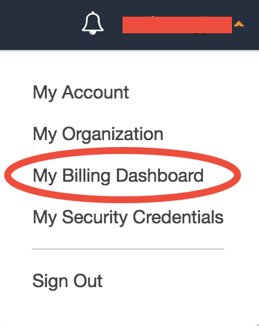
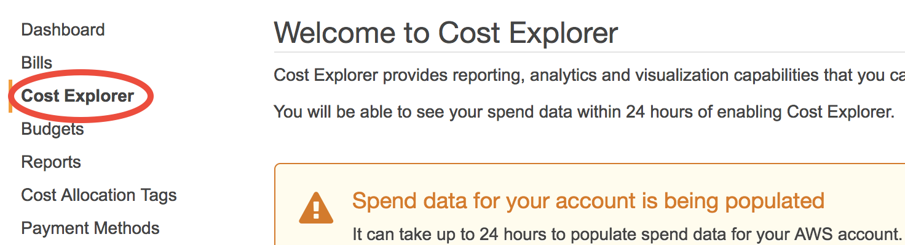
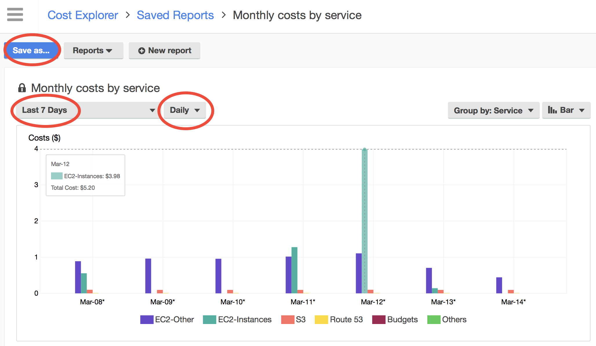

Monitoring AWS cost
===================

Time to talk about money. The :ref:`Researcher’s Handbook <researcher-handbook-label>` has a very comprehensive introduction to all kinds of budget management tools. I find that the `AWS Cost Explorer <https://aws.amazon.com/aws-cost-management/aws-cost-explorer/>`_ is the most straighforward and intuitive one.

Go to your billing console:

Select "Cost Explorer". For the first time, you need to enable it and wait for 24 hours.

AWS provides several pre-configured cost reports in "Saved Reports". Let's choose "Monthly costs by service":

.. figure:: img/saved-reports.png
  :width: 550px

The default, monthly frequency won't give you too much information if you just start to use AWS. Let's change it to "Daily" over the "Last 7 Days":

You can see the day-to-day cost very clearly, broken into EC2, S3, and other charges. "EC2-Other" generally refers to EBS volumes. You can also click on "Save as" to create a new "Daily costs by service" report for future use.

.. note::

  For some reason, you might be directed to the `Simple Monthly Calculator <https://calculator.s3.amazonaws.com/index.html>`_, say if you just google "estimate aws cost". This tool is not going to help you because it is for estimating the cost of web servers. Web servers run stably for a long time, so their costs are very easy to pre-calculate. On the other hand, scientific computing workloads are intermittent and hard to predict. So, the most helpful thing you can do is looking at the history.