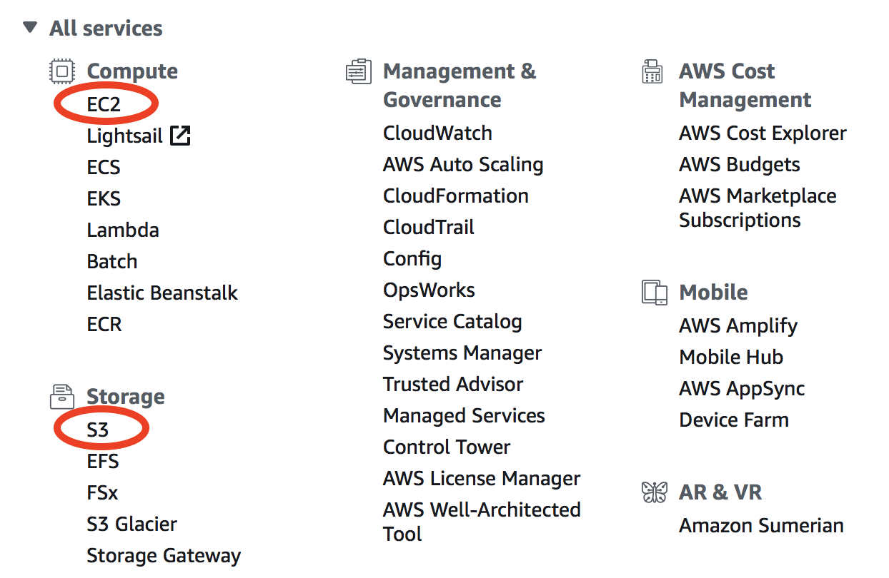

Overview of basic AWS compute and storage services
==================================================

In the :ref:`quick start guide <quick-start-label>`, you have used **EC2 (Elastic Compute Cloud)** to perform simulations and data analysis. Unlike your local server, cloud platforms are designed to be ephemeral -- you can launch or shut down servers at any time. No up-front investment, no hardware maintenance. This flexibility is a great advantage of cloud platforms, but it also means that you need to take special care of your data. On local servers, one can simply log out after the work is done. But if you simply terminate your cloud server, all data will disappear. Instead of keeping your server running (which incurs hourly cost), a much cheaper and cleverer way is to move data to other storage services.

AWS has hundreds of services (shown in the main console; see the figure below), and EC2 is just one of them. Fortunately, a tiny subset of services is enough for scientific computing. The most important services are **EC2** for compute and **S3** for storage. Tons of other services are targeted at IT/Business applications that scientists can safely ignore:

Core AWS concepts for scientific computing
------------------------------------------

In this section you will familiarize yourself with the following concepts and their costs: EC2, Spot Instances, AMI, EBS, S3, and Data egress charge.

- `EC2 (Elastic Compute Cloud) <https://aws.amazon.com/ec2/>`_ is the major computing service. You can create any number of servers (called "EC2 instances" in AWS context). They are just like normal servers that you can ``ssh`` to, to perform various computing tasks. Unlike local servers that have fixed hardware capacity and static software environment, EC2 instances are highly-customizable. For hardware, there are tons of `EC2 instances types <https://aws.amazon.com/ec2/instance-types/>`_ with different capacities in CPUs, memory, and disk storage. For software, you can start with a brand new operating system, or use other people's system images as you did in the quick start guide. `The price of EC2 <https://aws.amazon.com/ec2/pricing/>`_ is roughly $0.01 /CPU/hour. The cost can be reduced by ~70% with `spot pricing <https://aws.amazon.com/ec2/spot/>`_ (but with some caveats as :ref:`detailed later <spot-label>`).

.. note::
  
  EC2 used to charge by hours but it now uses `per-second billing <https://aws.amazon.com/blogs/aws/new-per-second-billing-for-ec2-instances-and-ebs-volumes/>`_. That's a great saving for short simulations -- a 10-min simulation is only charged as 1/6 hour.

* `AMI (Amazon Machine Image) <https://docs.aws.amazon.com/AWSEC2/latest/UserGuide/AMIs.html>`_ is a frozen system image of an EC2 instance. It contains the operating system, the software libraries, and all the files on a server. An AMI can be used to create any number of EC2 instances. Once a model is configured and saved as an AMI, any researchers can replicate the same environment and start using the model instantly. Some good examples are the `Deep Learning AMI <https://aws.amazon.com/marketplace/pp/B077GCH38C>`_ and the `OpenFOAM AMI <https://aws.amazon.com/marketplace/pp/B017AHYO16>`_.

.. _ebs-intro-label:

- `EBS (Elastic Block Storage) <https://aws.amazon.com/ebs/>`_ is a disk storage service to increase the disk capacity of existing EC2 instances. You create an "EBS volume" and "attach" it to an EC2 instance, just like attaching a USB drive to a computer. You will learn how to do this later. The default disk storage of the EC2 instance itself is also an "EBS volume". EBS is suitable for temporarily hosting files that you are directly working with. For long-term, persistent storage, S3 (see below) is a much better option. `The price of EBS volumes <https://aws.amazon.com/ebs/pricing/>`_ is $0.1/GB/month.

.. _s3-intro-label:

* `S3 (Simple Storage Service) <https://aws.amazon.com/s3/>`_ is the major storage service on AWS. Unlike traditional hard disk storage, S3 uses `object storage model <https://en.wikipedia.org/wiki/Object_storage>`_ which is much more scalable. Traditional disks have limited storage capacity -- once you hit the limit you need to either delete some data or buy new disks; EBS volumes are just like physical disks so also have limits, although you can create new volumes easily; **S3, on the other hand, has almost no capacity limit** -- you can dump as many data into it as you like. `The price of S3 <https://aws.amazon.com/s3/pricing/>`_ is $0.023/GB/month, only 23% of EBS price.

  S3 is thus the default storage mechanism for most of :ref:`Earth Science Big Data <earth-data-label>`. Later in this tutorial you will learn how to access all 30 TB of GEOS-Chem input data on S3, as well as other  `public Earth Science data on AWS <https://aws.amazon.com/earth/>`_. You will also upload your own data (e.g. model simulation results) to S3.

.. _data-egress-label:

- **Data egress charge** is an additional charge besides compute (EC2) and storage (EBS, S3). While **transferring data into the cloud is free**, almost all commercial cloud providers **charge for data transferring out of their cloud** -- that's how they make money and encourage people to keep stuff within their cloud. The data egress fee on AWS is $0.09/GB. AWS does also offer `Data egress discount to researchers <https://aws.amazon.com/blogs/publicsector/aws-offers-data-egress-discount-to-researchers/>`_, but the discount cannot exceed 15% of total AWS cost.

  The data egress fee is actually not a big worry because:
  
  (1) For small data (~GBs), the cost is quite low.
  (2) For large data (~TBs), downloading takes a long time so we would like to avoid downloading them anyway. After all, the key idea of cloud computing is "bringing compute to data". With Python and Jupyter, analyzing simulation results on the cloud is just as convenient as having data locally available.

That's all core concepts you need to remember. For a more complete review, see :doc:`../chapter05_aws-in-detail/index`. For first-time readers, simply go to the next hands-on tutorial. The best way to learn cloud computing is trying it yourself.
